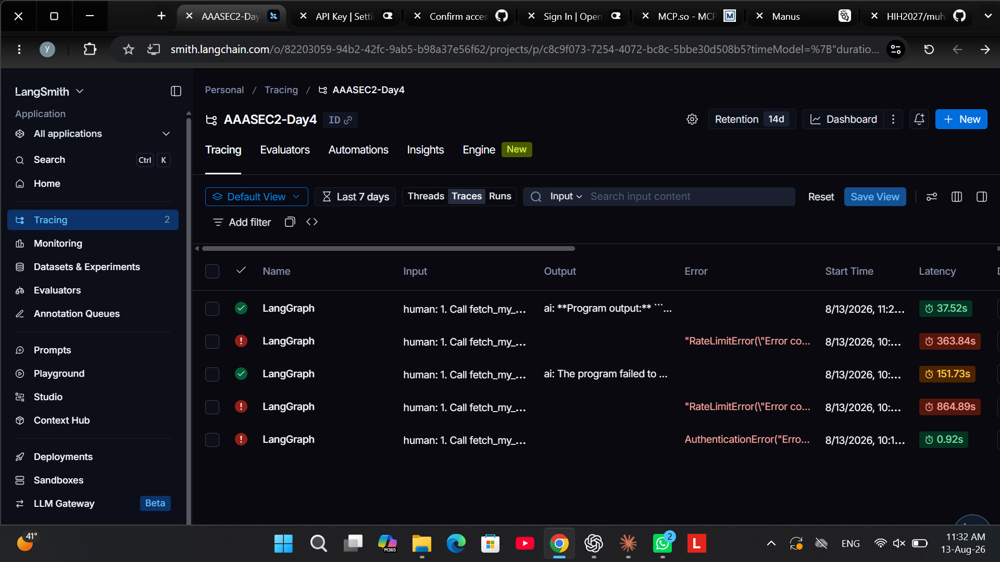

# Day 4 — Agents Get Computers

Day 3 turned your agent into a network service. Day 4 gives it what it's been missing — and immediately puts fences around it:

```
Agents get YOUR computer.        →  feel why that's scary.   (00, 04)
Agents become harder to debug.   →  trace them.              (01)
Agents access private things.    →  authenticate them.       (02)
Give them a RENTED computer.     →  extra, if time.          (05)
```

Same format as Day 3: markdown guides, `src/` skeletons that point at them, Git as the spine, `solutions/` when you're truly stuck. Work on your `day4` branch (`git switch -c day4-sandbox`).

| Guide | You build |
|---|---|
| `00-deep-agent-shell.md` | an agent that writes AND executes code — on your machine, eyes open |
| `01-langsmith.md` | nothing — you turn on tracing and *read* one |
| `02-mcp-auth.md` | an MCP server with a public and a protected tool (verify script given) |
| `03-putting-it-together.md` | one mission using all three |
| `04-challenge.md` | fill-in-the-blanks template + one adversarial poke (it will sting) |
| `05-extra-sandbox.md` | *extra:* the same agent on a real sandbox (Daytona) |

## Setup

```bash
cd day4
uv sync
cp .env.example .env      # OpenRouter key + LangSmith key + the two MCP tokens
```

One account you need (free tier): **LangSmith** (smith.langchain.com). Daytona (app.daytona.io) only if you attempt the `05` extra: `uv sync --group daytona`.

Note there is **no `USE_FAKE` today**. The entire point of Day 4 is real execution — a fake would teach nothing.

## The one diagram

```
                  LangSmith
                     â–²  traces (env vars, zero code)
                     │
User ──► Deep Agent ─┤
           │         │
           │ tool    │ backend
           â–¼         â–¼
 Authenticated MCP  Shell backend
   (information)   (computation: filesystem + execute —
                    local today, sandboxed in the extra)
```
## Submission Evidence

The authenticated challenge completed successfully with a grand total of
`3890 SAR` and correctly flagged `TS101 iron` because its quantity is below 5.
LangSmith project `AAASEC2-Day4` recorded the successful root run
`019ffa35-424f-7333-8d1c-067b33513bcf`.

